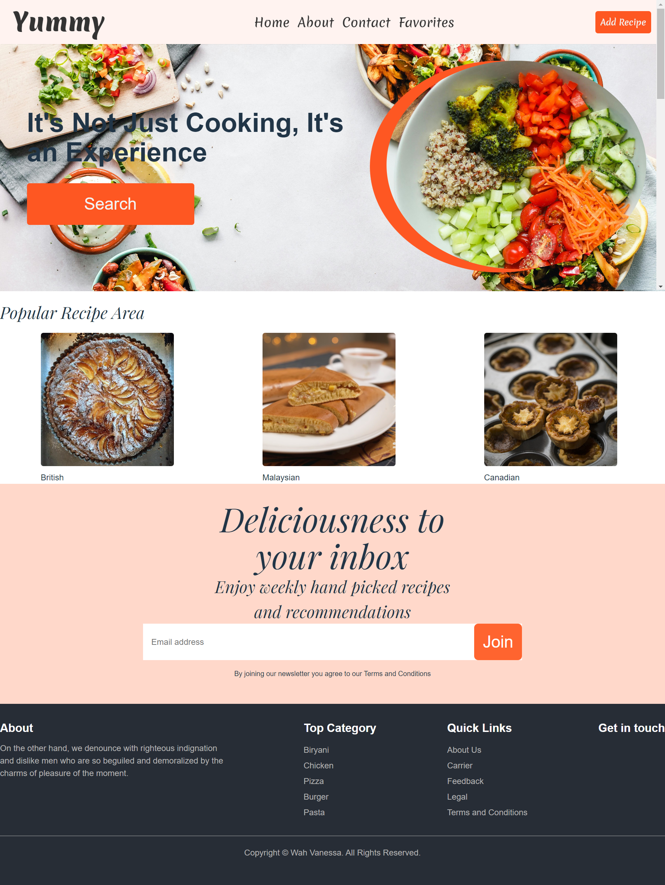

# Yummy Meal finder

This app is for user to search meal view the details add meal to favorite remove meal

## Deployement

to view this aplication all you need to have is a code editor an any favorite browser of your choice

## Visuals

the following image

## homepage


# Food Recipe App (ReactJS)

## Overview
The **Food Recipe App** is a web application built using **ReactJS** that allows users to search for various food recipes by ingredients or cuisine type. The app fetches recipe data from an external API and displays detailed information about each recipe, including ingredients, instructions, and images. The user can browse, filter, and explore different recipes for inspiration.

## Features
- **Search Recipes:** Search for recipes by ingredients or dish names.
- **Recipe Details:** View detailed information about each recipe, such as ingredients, cooking steps, and images.
- **Responsive Design:** The app is fully responsive and works on various screen sizes (mobile, tablet, desktop).
- **Favorites:** Save favorite recipes to a list for easy access (optional feature).
  
## Technologies Used
- **ReactJS:** Frontend JavaScript library for building user interfaces.
- **Fetch API:** For making HTTP requests to fetch recipe data from an external API.
- **React Router:** For handling navigation between different app pages (Home, Recipe Detail, etc.).
- **CSS Modules/Styled Components:** For styling the application.

## Setup Instructions
1. Clone the repository:
   ```bash
   git clone https://github.com/your-username/Food-recipe-app-using-ReactJS.git
   ```
2. Navigate to the project directory:
   ```bash
   cd Food-recipe-app-using-ReactJS
   ```
3. Install dependencies:
   ```bash
   npm install
   ```
4. Create a `.env` file in the root directory and add your recipe API key:
   ```
   REACT_APP_API_KEY=your-api-key
   ```
5. Run the app:
   ```bash
   npm start
   ```
6. Open your browser and navigate to `http://localhost:3000` to use the app.

## External API
The app uses an external food recipe API to fetch recipe data.

